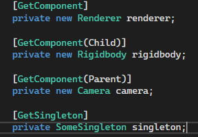
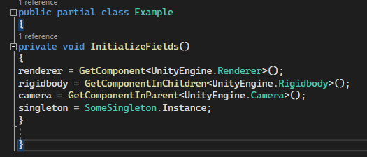
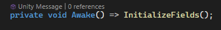
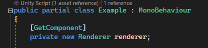

# Unity Source Generator

This is a small example of a source generator for extending Unity scripting.
It is based on the following resources:

https://medium.com/@EnescanBektas/using-source-generators-in-the-unity-game-engine-140ff0cd0dc

https://docs.unity3d.com/Manual/roslyn-analyzers.html

To learn more about source generators, see:

https://learn.microsoft.com/en-us/dotnet/csharp/roslyn-sdk/source-generators-overview

This is not a Unity project, but a .NET library project. It can be compiled using Visual Studio, and the resulting library (.dll file) can be added to a Unity Project (Unity 2021 or higher).

The current version provides an auto-generated "GetComponent" and "GetSingleton" attribute:

When any of these attributes are present on fields, the generator adds a function to the containing class that takes care of initializing the given fields using the method specified by their attribute.

For the above example, the compile-time auto-generated code looks like this (I promise I'll work on the indentation):

The auto generated code is not written to any file, however, it is still visible within Visual Studio, and Intellisense is aware of it, so no error squiggles (Yay!)

On the user side, you can call the generated function e.g. at Awake time:

In order for the generator to be able to add any logic, your class must be declared with the **partial** keyword:

The code examples above are from an example project for testing the generator output, found here:

https://github.com/Lovely-Bytes-Gaming/SourceGeneratorSandbox